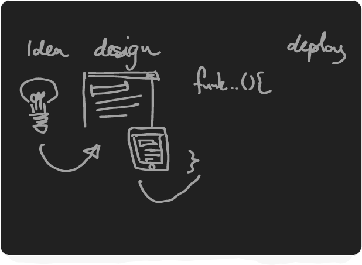

### Hi there im Christian! 👋

Im a graphic designer, turned developer. I love being able to solve issues and create features with creativity.

I enjoy brainteasers, I play chess, I strive to learn something new each day. Thankfully being a developer combines

<!--
**Christian-Mogensen/Christian-Mogensen** is a ✨ _special_ ✨ repository because its `README.md` (this file) appears on your GitHub profile.

Here are some ideas to get you started:

- 🔭 I’m currently working on ...
- 🌱 I’m currently learning ...
- 👯 I’m looking to collaborate on ...
- 🤔 I’m looking for help with ...
- 💬 Ask me about ...
- 📫 How to reach me: ...
- 😄 Pronouns: ...
- ⚡ Fun fact: ...
  -->
